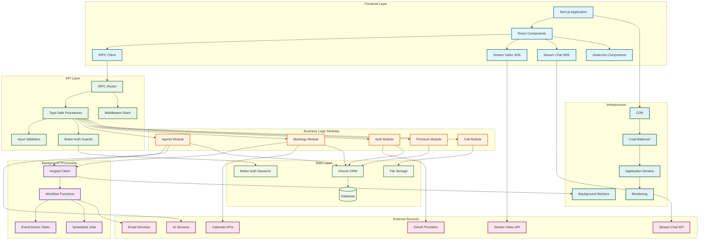
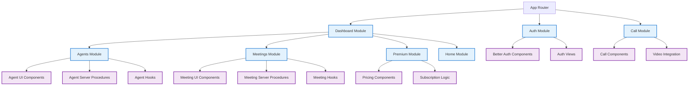

# Meetvix
## AI-Powered Meeting Platform & Virtual Assistant Hub

[](https://www.typescriptlang.org/)
[](https://nextjs.org/)
[](https://reactjs.org/)
[](https://trpc.io/)
[](https://orm.drizzle.team/)
[](https://getstream.io/)
[](https://tailwindcss.com/)
[](https://openai.com/)
[](https://www.inngest.com/)
[](https://better-auth.com/)
[](https://pnpm.io/)
[](https://polar.sh/)
[](https://ui.shadcn.com/)
[](https://tanstack.com/query)
[](https://zod.dev/)
[](https://eslint.org/)

> A comprehensive AI-powered meeting platform featuring intelligent virtual agents, real-time video communication, automated transcriptions, and smart meeting analytics.

## 🚀 Overview

Meetvix is a next-generation meeting platform that revolutionizes how teams collaborate through AI-powered virtual agents, seamless video conferencing, and intelligent automation. Built with modern technologies and designed for scalability, Meetvix provides enterprises with the tools to enhance productivity and streamline meeting workflows.

### ✨ Key Features

- **🤖 AI Virtual Agents**: Create and manage intelligent meeting assistants with custom personalities and capabilities
- **📹 HD Video Conferencing**: Powered by Stream Video SDK for crystal-clear, low-latency communication
- **💬 Real-time Chat**: Integrated chat system with AI-powered suggestions and automated responses
- **📝 Smart Transcriptions**: Automated meeting transcriptions with AI-powered insights and action item extraction
- **📊 Meeting Analytics**: Comprehensive dashboard with meeting metrics, participant engagement, and productivity insights
- **🔄 Workflow Automation**: Inngest-powered background jobs for meeting scheduling, notifications, and follow-ups
- **🔐 Advanced Authentication**: Better Auth integration with OAuth providers, magic links, and 2FA support
- **👥 Agent Management**: Complete CRUD operations for AI agents with role-based permissions
- **📅 Meeting Scheduling**: Advanced scheduling system with calendar integrations and automated reminders
- **💳 Subscription Management**: Polar-powered billing system with tiered access and usage tracking
- **📱 Responsive Design**: Optimized for desktop, tablet, and mobile experiences

## 🏗️ High-Level System Architecture



## 🗂️ Project Structure

```
meetvix/
├── src/
│   ├── app/                           # Next.js App Router
│   │   ├── (auth)/                   # Authentication routes
│   │   │   ├── sign-in/              # Sign-in page
│   │   │   └── sign-up/              # Sign-up page
│   │   ├── (dashboard)/              # Main application dashboard
│   │   │   ├── agents/               # AI agents management
│   │   │   │   └── [agentId]/        # Individual agent details
│   │   │   ├── meetings/             # Meeting management
│   │   │   │   └── [meetingId]/      # Individual meeting details
│   │   │   ├── upgrade/              # Subscription upgrade
│   │   │   └── page.tsx              # Dashboard home
│   │   ├── call/                     # Video call interface
│   │   │   └── [meetingId]/          # Meeting room
│   │   └── api/                      # API routes
│   │       ├── auth/                 # Better Auth endpoints
│   │       ├── trpc/                 # tRPC API handler
│   │       ├── inngest/              # Inngest webhook
│   │       └── webhook/              # External webhooks
│   ├── components/                   # Shared components
│   │   ├── ui/                       # shadcn/ui components
│   │   ├── data-table.tsx           # Reusable data table
│   │   ├── empty-state.tsx          # Empty state component
│   │   ├── error-state.tsx          # Error handling component
│   │   └── generated-avatar.tsx     # Dynamic avatar generator
│   ├── modules/                      # Feature-based modules
│   │   ├── agents/                   # AI Agents module
│   │   │   ├── hooks/                # Agent-specific hooks
│   │   │   ├── server/               # Server procedures
│   │   │   ├── ui/                   # UI components & views
│   │   │   │   ├── components/       # Agent components
│   │   │   │   └── views/            # Agent views
│   │   │   ├── schemas.ts            # Validation schemas
│   │   │   └── types.ts              # Type definitions
│   │   ├── meetings/                 # Meetings module
│   │   │   ├── hooks/                # Meeting hooks
│   │   │   ├── server/               # Meeting procedures
│   │   │   ├── ui/                   # Meeting UI
│   │   │   │   ├── components/       # Meeting components
│   │   │   │   └── views/            # Meeting views
│   │   │   └── schema.ts             # Meeting schemas
│   │   ├── auth/                     # Authentication module
│   │   │   └── ui/                   # Auth components
│   │   ├── call/                     # Video call module
│   │   │   └── ui/                   # Call interface
│   │   ├── dashboard/                # Dashboard module
│   │   │   └── ui/                   # Dashboard components
│   │   ├── home/                     # Home page module
│   │   └── premium/                  # Subscription module
│   ├── trpc/                         # tRPC configuration
│   │   ├── routers/                  # API routers
│   │   ├── client.tsx                # Client setup
│   │   ├── server.ts                 # Server setup
│   │   └── init.ts                   # tRPC initialization
│   ├── inngest/                      # Background job system
│   │   ├── client.ts                 # Inngest client
│   │   └── functions.ts              # Workflow functions
│   ├── lib/                          # Utility libraries
│   │   ├── auth.ts                   # Better Auth configuration
│   │   ├── auth-client.ts            # Better Auth client setup
│   │   ├── stream-video.ts           # Stream Video setup
│   │   ├── stream-chat.ts            # Stream Chat setup
│   │   ├── polar.ts                  # Billing integration
│   │   └── utils.ts                  # General utilities
│   ├── db/                           # Database configuration
│   │   ├── index.ts                  # Database connection
│   │   └── schema.ts                 # Drizzle schema
│   └── hooks/                        # Custom React hooks
├── public/                           # Static assets
├── drizzle.config.ts                 # Drizzle configuration
├── next.config.ts                    # Next.js configuration
├── pnpm-workspace.yaml               # PNPM workspace config
└── package.json                      # Dependencies
```

## 🛠️ Tech Stack

### Frontend
- **Framework**: Next.js 14+ (App Router)
- **Language**: TypeScript
- **UI Library**: React 18+
- **Styling**: Tailwind CSS
- **Components**: shadcn/ui
- **Icons**: Lucide React

### Backend & API
- **API Framework**: tRPC (Type-safe APIs)
- **ORM**: Drizzle ORM
- **Authentication**: Better Auth
- **Background Jobs**: Inngest
- **Validation**: Zod schemas

### Real-time Communication
- **Video**: Stream Video SDK
- **Chat**: Stream Chat SDK
- **WebRTC**: Built-in browser support

### External Integrations
- **Billing**: Polar (subscription management)
- **AI Services**: Custom AI agent integration
- **Calendar**: Calendar API integrations
- **Email**: Email service providers

### Development Tools
- **Package Manager**: PNPM
- **Linting**: ESLint
- **Type Checking**: TypeScript
- **Build Tool**: Next.js built-in

## 📋 Prerequisites

- Node.js 18+
- PNPM (recommended package manager)
- Database (PostgreSQL recommended)
- Stream account (for video/chat)
- Polar account (for billing)

## 🚀 Quick Start

### 1. Clone the Repository
```bash
git clone https://github.com/ismail-gits/meetvix.git
cd meetvix
```

### 2. Install Dependencies
```bash
pnpm install
```

### 3. Environment Setup
Create a `.env.local` file in the root directory:

```env
# Database
DATABASE_URL="your-database-url"

# Better Auth
BETTER_AUTH_SECRET="your-better-auth-secret"
BETTER_AUTH_URL="http://localhost:3000"

# OAuth Providers (optional)
GITHUB_CLIENT_ID="your-github-client-id"
GITHUB_CLIENT_SECRET="your-github-client-secret"
GOOGLE_CLIENT_ID="your-google-client-id"
GOOGLE_CLIENT_SECRET="your-google-client-secret"

# Stream Configuration
NEXT_PUBLIC_STREAM_API_KEY="your-stream-api-key"
STREAM_SECRET_KEY="your-stream-secret-key"

# Inngest
INNGEST_EVENT_KEY="your-inngest-event-key"
INNGEST_SIGNING_KEY="your-inngest-signing-key"

# Polar Billing
POLAR_ACCESS_TOKEN="your-polar-access-token"
POLAR_WEBHOOK_SECRET="your-polar-webhook-secret"

# AI Services (if applicable)
OPENAI_API_KEY="your-openai-api-key"
```

### 4. Database Setup
```bash
# Generate and push database schema
pnpm run db:generate
pnpm run db:push
```

### 5. Start Development Server
```bash
pnpm run dev
```

Visit `http://localhost:3000` to see the application.

## 🎯 Core Features Deep Dive

### AI Virtual Agents
- **Agent Creation**: Create custom AI agents with specific roles and capabilities
- **Personality Customization**: Define agent behavior, response patterns, and expertise areas
- **Meeting Integration**: Agents can join meetings, take notes, and provide insights
- **Analytics**: Track agent performance and user interactions

### Meeting Management
- **Scheduling**: Advanced meeting scheduling with calendar integration
- **Real-time Video**: HD video conferencing with screen sharing
- **Chat Integration**: Persistent chat with meeting history
- **Recording**: Automated meeting recording and transcription
- **Status Tracking**: Meeting states (upcoming, active, completed, cancelled)

### Better Auth Integration
- **Multiple Providers**: Support for OAuth (GitHub, Google, Discord, etc.)
- **Magic Links**: Passwordless authentication for seamless user experience
- **Two-Factor Authentication**: Enhanced security with TOTP support
- **Session Management**: Secure JWT-based sessions with refresh tokens
- **User Management**: Complete user profile and preference management

### Background Automation
- **Event-Driven Workflows**: Inngest-powered automation for meeting lifecycle
- **Scheduled Tasks**: Automatic reminders, follow-ups, and analytics processing
- **Webhook Processing**: Handle external service integrations
- **Email Notifications**: Automated email campaigns and notifications

### Subscription Management
- **Tiered Plans**: Multiple subscription tiers with different feature access
- **Usage Tracking**: Monitor API usage and feature utilization
- **Billing Automation**: Automated billing cycles with Polar integration
- **Upgrade Flow**: Seamless subscription upgrade experience

## 🔧 API Endpoints (tRPC Procedures)

### Agents
- `agents.list` - List user agents with filtering
- `agents.create` - Create new AI agent
- `agents.get` - Get agent details
- `agents.update` - Update agent configuration
- `agents.delete` - Delete agent

### Meetings
- `meetings.list` - List meetings with filters
- `meetings.create` - Schedule new meeting
- `meetings.get` - Get meeting details
- `meetings.update` - Update meeting information
- `meetings.cancel` - Cancel meeting
- `meetings.join` - Join meeting session

### Premium
- `premium.getSubscription` - Get user subscription details
- `premium.createCheckout` - Create subscription checkout
- `premium.manageSubscription` - Manage billing portal

## 📊 Module Architecture



## 🔒 Security Features

- **Type-Safe APIs**: tRPC ensures end-to-end type safety
- **Input Validation**: Zod schema validation for all inputs
- **Better Auth Integration**: Modern authentication with multiple providers
- **Secure Sessions**: JWT-based session management with refresh tokens
- **OAuth Support**: GitHub, Google, Discord, and custom provider integration
- **Rate Limiting**: API rate limiting implementation
- **CSRF Protection**: Built-in CSRF protection with Better Auth
- **Data Sanitization**: XSS and injection prevention

## 🚀 Deployment

### Prerequisites
- Database server (PostgreSQL/MySQL)
- Stream account setup
- Polar billing configuration
- Inngest environment setup
- Better Auth OAuth app configurations

### Environment Variables
Ensure all required environment variables are configured:
- Database connections
- Better Auth secrets and OAuth credentials
- Stream API credentials
- Billing provider keys
- Background job configurations

### Build and Deploy
```bash
# Build the application
pnpm run build

# Start production server
pnpm start
```

## 🤝 Contributing

1. Fork the repository
2. Create a feature branch (`git checkout -b feature/amazing-feature`)
3. Commit your changes (`git commit -m 'Add some amazing feature'`)
4. Push to the branch (`git push origin feature/amazing-feature`)
5. Open a Pull Request

### Development Guidelines
- Follow the modular architecture pattern
- Use tRPC for all API interactions
- Implement proper error handling
- Add comprehensive tests
- Follow TypeScript best practices
- Use Better Auth for all authentication needs

## 📝 License

This project is licensed under the MIT License - see the [LICENSE](LICENSE) file for details.

## 👨‍💻 Author

**Ismail**
- GitHub: [@ismail-gits](https://github.com/ismail-gits)

## 🆘 Support

For support, please open an issue in the GitHub repository or contact the development team.

## 🗺️ Roadmap

- [ ] Advanced AI agent capabilities
- [ ] Multi-language support for transcriptions
- [ ] Integration with popular calendar systems
- [ ] Mobile app development
- [ ] Advanced analytics dashboard
- [ ] Team collaboration features
- [ ] Custom branding options
- [ ] API for third-party integrations
- [ ] Enterprise SSO integration
- [ ] Advanced Better Auth features

---

⭐ **Star this repo if you find it helpful!**
